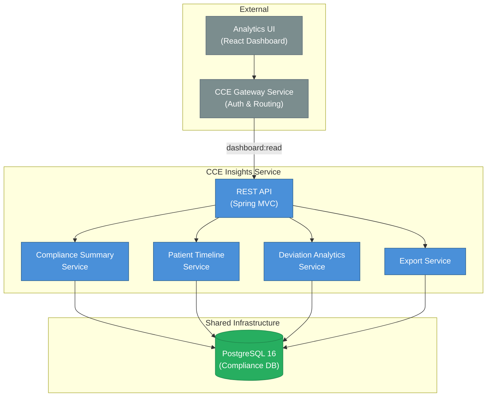

# Architecture & Design

## 1. System Context

The **CCE Insights Service** (referred to as "Analytics Service" in the Solution Design v0.3) serves compliance analytics data — protocol adherence rates, deviation trends, facility-level summaries, and patient compliance timelines. It is a **read-only** service that queries the Compliance DB directly and exposes REST APIs consumed by the Analytics UI dashboard.

> All inbound requests arrive via the **CCE Gateway Service**, which validates OAuth tokens and enforces the `dashboard:read` scope. The Insights Service does not handle authentication or authorization.



**This service does NOT handle:** event ingestion, protocol matching, step completion, deviation detection, time-based transitions, authentication/authorization, or any write operations.

---

## 2. Technology Stack

| Concern | Technology | Version |
|---------|------------|---------|
| Language | Java | 21 (LTS) |
| Framework | Spring Boot | 3.4.x |
| Build tool | Gradle | 8.x |
| Database | PostgreSQL | 16+ (shared with Compliance Service) |
| DB access | Spring Data JPA + Hibernate | (Spring Boot managed) |
| Observability | Micrometer + Prometheus | (Spring Boot managed) |
| Testing | JUnit 5, Testcontainers, MockMvc | |

### Key Gradle Dependencies

```groovy
// Spring Boot starters
implementation 'org.springframework.boot:spring-boot-starter-web'
implementation 'org.springframework.boot:spring-boot-starter-data-jpa'
implementation 'org.springframework.boot:spring-boot-starter-actuator'
implementation 'org.springframework.boot:spring-boot-starter-validation'

// Database
runtimeOnly 'org.postgresql:postgresql'

// Observability
implementation 'io.micrometer:micrometer-registry-prometheus'

// Testing
testImplementation 'org.springframework.boot:spring-boot-starter-test'
testImplementation 'org.testcontainers:postgresql'
testImplementation 'org.testcontainers:junit-jupiter'
```

**Not included:** Spring Kafka (no Kafka integration), Flyway (no owned tables), HAPI FHIR (no FHIR parsing), json-logic-java (no expression evaluation).

---

## 3. Package Structure

```
src/main/java/org/openphc/cce/insights/
├── InsightsServiceApplication.java            # @SpringBootApplication
├── config/
│   ├── JpaConfig.java                         # Read-only transaction defaults
│   └── ObservabilityConfig.java               # Custom metrics
├── domain/
│   ├── entity/
│   │   ├── ProtocolDefinition.java            # Read-only entity
│   │   ├── ProtocolInstance.java              # Read-only entity
│   │   ├── StepInstance.java                  # Read-only entity
│   │   ├── Deviation.java                     # Read-only entity
│   │   └── EventLog.java                      # Read-only entity
│   ├── enums/
│   │   ├── ProtocolInstanceStatus.java        # ACTIVE, COMPLETED, WITHDRAWN, EXPIRED
│   │   ├── StepState.java                     # PENDING, DUE, OVERDUE, MISSED, COMPLETED, SKIPPED
│   │   ├── CompletionStatus.java              # EARLY, ON_TIME, LATE
│   │   └── DeviationType.java                 # OVERDUE, MISSED
│   └── repository/
│       ├── ProtocolDefinitionRepository.java
│       ├── ProtocolInstanceRepository.java
│       ├── StepInstanceRepository.java
│       ├── DeviationRepository.java
│       └── EventLogRepository.java
├── service/
│   ├── ComplianceSummaryService.java          # Protocol & facility compliance aggregation
│   ├── PatientTimelineService.java            # Patient event timeline + tracking
│   ├── DeviationAnalyticsService.java         # Deviation trends & analysis
│   └── ExportService.java                     # CSV/JSON export generation
├── web/
│   ├── controller/
│   │   ├── ComplianceSummaryController.java
│   │   ├── PatientController.java
│   │   ├── DeviationController.java
│   │   └── ExportController.java
│   └── dto/
│       ├── ComplianceSummaryDto.java
│       ├── FacilitySummaryDto.java
│       ├── PatientComplianceDto.java
│       ├── PatientTimelineDto.java
│       ├── DeviationDto.java
│       ├── DeviationTrendDto.java
│       ├── IntelligenceSummaryDto.java
│       └── DtoMapper.java

src/main/resources/
├── application.yml
└── application-docker.yml

src/test/java/org/openphc/cce/insights/           # Unit tests
src/integrationTest/java/org/openphc/cce/insights/ # Integration tests
```

**Total:** ~30 source files across 10 packages.

---

## 4. Data Access Patterns

### 4.1 Read-Only Design

All database access uses `@Transactional(readOnly = true)`. The Insights Service never performs `INSERT`, `UPDATE`, or `DELETE` operations. JPA entities can use `@Immutable` to enforce this at the Hibernate level.

### 4.2 Tables Queried

| Table | Owner | Queries Used For |
|---|---|---|
| `protocol_definition` | Compliance Service | Protocol metadata (name, version, canonical URL) |
| `protocol_instance` | Compliance Service | Patient enrollments, compliance rates, filtering by status/facility |
| `step_instance` | Compliance Service | Step states, timing, completion status, aggregation |
| `deviation` | Compliance Service | Deviation records, trends, counts by type |
| `event_log` | Compliance Service | Patient event history, timeline visualization |

### 4.3 Key Query Patterns

**Protocol Compliance Summary:**
```sql
SELECT
  pd.url || '|' || pd.version AS protocol_canonical,
  COUNT(DISTINCT pi.id) AS total_enrollments,
  COUNT(DISTINCT CASE WHEN pi.status = 'COMPLETED' THEN pi.id END) AS completed,
  COUNT(DISTINCT CASE WHEN pi.status = 'ACTIVE' THEN pi.id END) AS active,
  AVG(
    CASE WHEN pi.status IN ('ACTIVE', 'COMPLETED') THEN
      (SELECT COUNT(*) FROM step_instance si WHERE si.protocol_instance_id = pi.id AND si.state = 'COMPLETED')::float /
      NULLIF((SELECT COUNT(*) FROM step_instance si WHERE si.protocol_instance_id = pi.id), 0)
    END
  ) AS avg_compliance_rate
FROM protocol_instance pi
JOIN protocol_definition pd ON pi.protocol_definition_id = pd.id
WHERE pd.id = :protocolDefinitionId
GROUP BY pd.url, pd.version;
```

**Facility Compliance Summary:**
```sql
SELECT
  el.facility_id,
  COUNT(DISTINCT pi.id) AS total_enrollments,
  COUNT(DISTINCT CASE WHEN si.state IN ('OVERDUE', 'MISSED') THEN pi.id END) AS with_deviations
FROM protocol_instance pi
JOIN step_instance si ON si.protocol_instance_id = pi.id
JOIN event_log el ON el.protocol_instance_id = pi.id
WHERE el.facility_id = :facilityId
  AND el.facility_id IS NOT NULL
GROUP BY el.facility_id;
```

**Deviation Trends:**
```sql
SELECT
  DATE_TRUNC(:interval, d.detected_at) AS period,
  d.deviation_type,
  COUNT(*) AS count
FROM deviation d
WHERE d.detected_at BETWEEN :startDate AND :endDate
GROUP BY period, d.deviation_type
ORDER BY period;
```

---

## 5. Phased Architecture

| Phase | Data Source | Caching | Trade-off |
|---|---|---|---|
| **Phase 1 (current)** | Compliance DB `cce_collector` (direct queries) | None | Simpler deployment; acceptable at low-to-moderate scale |
| **Phase 2 (future)** | Dedicated analytics DB (materialized views or CDC) | Redis | Query performance at scale; eventual consistency |

Phase 1 is appropriate for initial deployments. Phase 2 transition will be transparent to API consumers — same endpoints, same response schemas.

---

## 6. Error Handling

| Scenario | Response | HTTP Status |
|---|---|---|
| Resource not found | `{ "error": { "code": "NOT_FOUND", "message": "..." } }` | 404 |
| Invalid query parameters | `{ "error": { "code": "VALIDATION_ERROR", "message": "..." } }` | 400 |
| Database unreachable | `{ "error": { "code": "SERVICE_UNAVAILABLE", "message": "..." } }` | 503 |
| Unexpected error | `{ "error": { "code": "INTERNAL_ERROR", "message": "..." } }` | 500 |

---

## 7. Observability

### Metrics

| Metric | Type | Tags | Description |
|---|---|---|---|
| `cce.insights.request.duration` | Timer | `endpoint`, `status` | REST endpoint response time |
| `cce.insights.query.duration` | Timer | `query_type` | Database query execution time |
| `cce.insights.request.count` | Counter | `endpoint`, `status` | Request count per endpoint |

### Health Indicators

| Indicator | Details |
|---|---|
| `db` (auto) | PostgreSQL connectivity |
| `diskSpace` (auto) | Disk space availability |

---

## 8. Scaling & Deployment

- **Stateless:** No local state, no Kafka consumer groups — can be scaled horizontally without coordination.
- **Deployment:** 2+ instances behind a load balancer for high availability.
- **Database connection pool:** Size per instance should account for total instances × pool size ≤ PostgreSQL `max_connections` allocation for analytics.
- **Read replicas (future):** Phase 2 can point the Insights Service at a PostgreSQL read replica to eliminate any impact on the Compliance Service's write performance.
