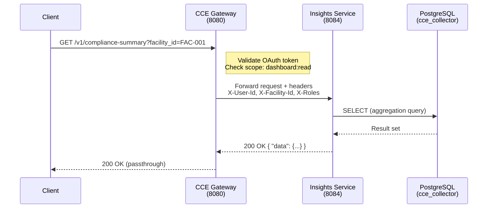
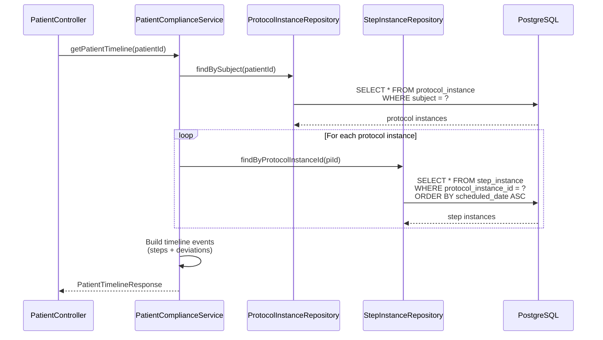
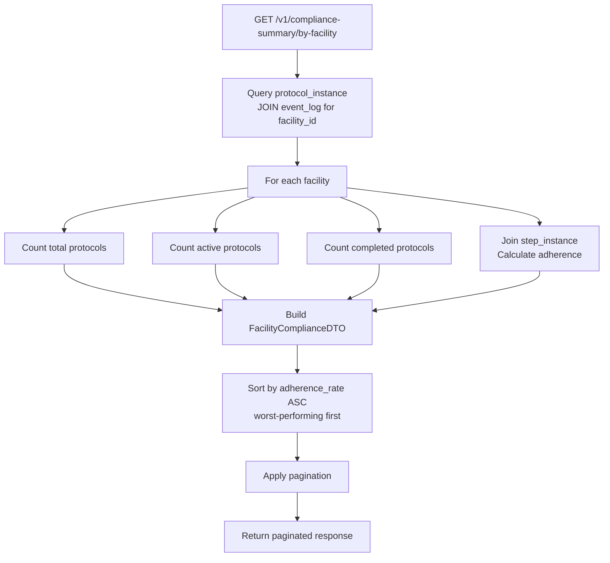
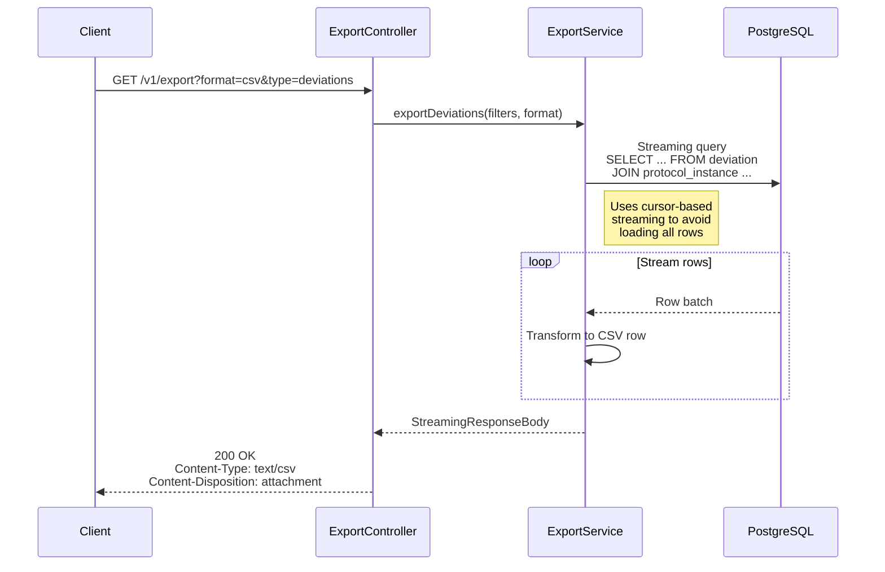

# Flow Diagrams

## 1. Request Flow: Gateway → Insights → Database



## 2. Compliance Summary Aggregation Flow

```mermaid
flowchart TD
    A[GET /v1/compliance-summary] --> B{facility_id<br/>provided?}
    B -- Yes --> C[Filter by facility_id]
    B -- No --> D[All facilities]
    C --> E[Query protocol_instance + step_instance]
    D --> E

    E --> F[Count step_instance by state<br/>per protocol_instance]
    F --> G{Calculate adherence_rate<br/>completed / total}
    G --> H{adherence_rate >= 80%?}
    H -- Yes --> I[on_track]
    H -- No --> J{adherence_rate >= 50%?}
    J -- Yes --> K[at_risk]
    J -- No --> L[non_compliant]

    I --> M[Group by protocol_canonical]
    K --> M
    L --> M
    M --> N[Build ComplianceSummaryResponse]
    N --> O[Return { data: ... }]
```

## 3. Patient Timeline Query Flow



## 4. Deviation Trend Analysis Flow

```mermaid
flowchart TD
    A[GET /v1/deviations/trends] --> B[Parse query params:<br/>type, facility_id, from, to]
    B --> C[Query deviation table<br/>with date range + filters]
    C --> D[GROUP BY deviation_type,<br/>DATE_TRUNC period]

    D --> E{period param?}
    E -- day --> F[DATE_TRUNC 'day']
    E -- week --> G[DATE_TRUNC 'week']
    E -- month --> H[DATE_TRUNC 'month']

    F --> I[Build trend data points]
    G --> I
    H --> I

    I --> J[Return DeviationTrendsResponse<br/>{ period, count, type }]
```

## 5. Facility Compliance Overview Flow



## 6. Export Flow


